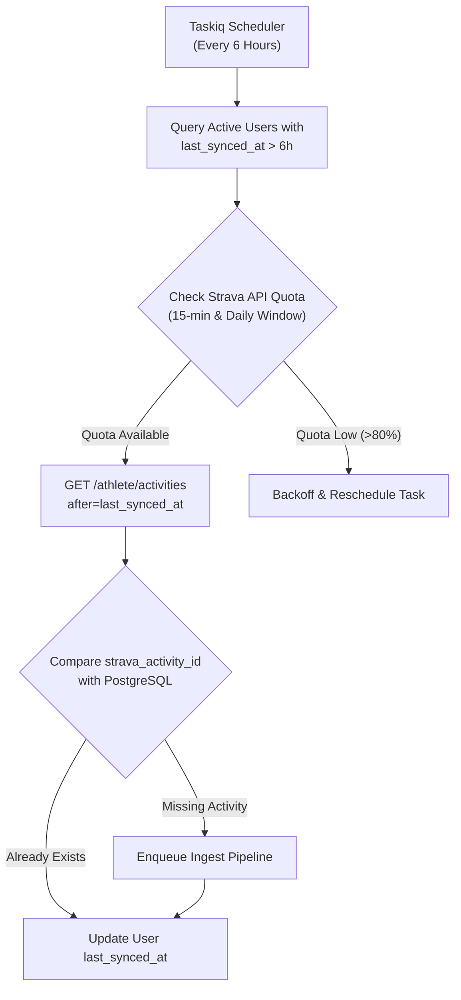
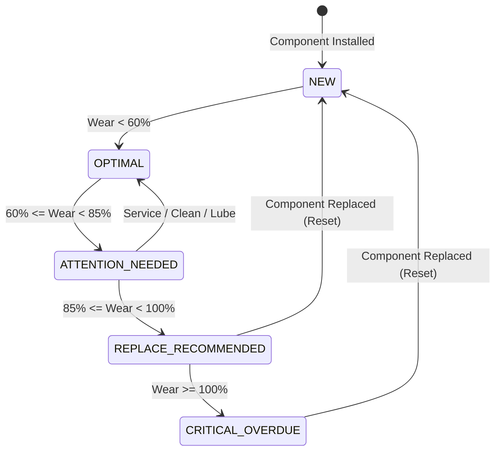
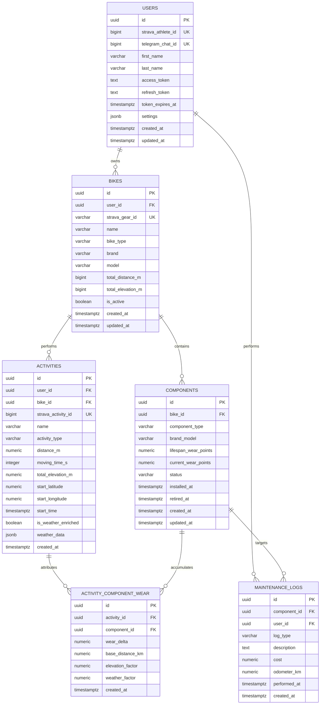

# VeloPulse System Architecture & Technical Specifications

This document outlines the architectural decisions, computational models, database design, and operational strategies governing **VeloPulse**.

---

## 1. Architectural Philosophy & Overview

VeloPulse operates as an **event-driven, decoupled micro-monolith** optimized for asynchronous task execution, high availability, and deterministic component wear calculations. 

The architecture separates latency-sensitive boundary operations (HTTP webhook reception, Telegram callbacks) from CPU- and I/O-intensive operations (external API enrichment, physics-based wear calculations, and notification dispatch).

```
[Strava Webhook Push] ───► [FastAPI Gateway] ──(Enqueue)──► [Redis 7 Task Broker]
                                  │                                   │
                           (204 No Content)                    [Taskiq Workers]
                                                                      │
                      ┌───────────────────────────────────────────────┴───────────────────────────────────────────────┐
                      ▼                                               ▼                                               ▼
           [Activity Processor]                             [Weather Enricher]                               [Wear Engine]
       (Fetch details & streams)                       (Open-Meteo precipitation/temp)              (Physics wear accumulation)
                      │                                               │                                               │
                      └───────────────────────────────────────────────┼───────────────────────────────────────────────┘
                                                                      ▼
                                                          [PostgreSQL 16 Database]
                                                                      │
                                                          [Notification Dispatcher]
                                                                      ▼
                                                      [Telegram Bot Engine (aiogram)]
```

---

## 2. Ingestion Strategy: Event-Driven Webhooks vs. Polling Fallback

Reliably capturing athletic activities from external platforms requires balancing near-instantaneous notification handling with resilience against network partitions and external outages.

### 2.1 Primary Ingestion: Event-Driven Webhooks

Strava provides real-time HTTP push events whenever an athlete creates, updates, or deletes an activity.

```
Strava Server               FastAPI Gateway              Redis / Taskiq               Worker
     │                             │                           │                        │
     │── POST /webhooks/strava ───►│                           │                        │
     │   {aspect_type: "create",   │                           │                        │
     │    object_id: 123456789,    │── LPUSH (task payload) ──►│                        │
     │    owner_id: 987654}        │                           │                        │
     │◄── HTTP 204 No Content ─────│                           │                        │
     │   (completed in <40ms)      │                           │── BPOPRPUSH ──────────►│
     │                             │                           │   (task consumed)      │
     │                             │                           │                        │── Fetch Streams
     │                             │                           │                        │── Process Ride
```

#### Webhook Ingestion Rules:
1. **Strict 2-Second Latency Constraint:** Strava mandates an HTTP 200/204 response within 2.0 seconds of dispatch. Any timeout results in Strava retrying and eventually disabling the webhook subscription.
2. **Offloading via Redis Queue:** The FastAPI endpoint performs zero database operations or third-party HTTP requests. It validates the subscription token, wraps the raw webhook event into a standardized Pydantic schema, pushes it onto the `default` Taskiq Redis queue, and returns `HTTP 204 No Content` within ~25–45ms.
3. **Idempotency Guard:** Webhook deliveries can be duplicated. The worker utilizes a Redis distributed key pattern `lock:activity_ingest:{strava_activity_id}` with an atomic `SETNX` (15-minute TTL) to guarantee single-execution semantics per activity.

---

### 2.2 Secondary Ingestion: Polling & Reconciliation Engine

While webhooks are the primary ingest vector, a purely event-driven architecture is vulnerable to:
- Network failures or downtime during webhook dispatch.
- User permission toggles / revoked tokens.
- Retroactive historical sync when a user first connects their Strava account.

To ensure eventual consistency, VeloPulse implements a **Targeted Polling & Reconciliation Engine**:



#### Polling Operational Guidelines:
- **Rate Limit Safeguards:** Strava enforces a 100-request/15-minute and 1,000-request/day budget per application. The poller queries a centralized Redis rate-limiter token bucket before issuing requests. If 15-minute consumption exceeds 80%, polling tasks self-suspend.
- **Cursor-Based Ingestion:** Uses Unix epoch timestamps (`after={last_synced_at}`) rather than page numbering, eliminating duplicates across pagination boundaries.

---

## 3. Wear Calculation Physics Engine

Bicycle components degrade due to a combination of mechanical load (torque/tension), abrasive friction, and corrosion. Linear distance-based tracking fails because these factors vary by orders of magnitude based on terrain and weather.

### 3.1 Mathematical Formulation

The base unit of degradation in VeloPulse is the **Wear Point ($WP$)**, calibrated such that **$1.0\text{ WP}$ represents the wear equivalent of $1.0\text{ km}$ ridden under ideal laboratory conditions** (clean, dry asphalt, zero grade, room temperature).

For any given activity $A$ and component $C$, the wear points accumulated $\Delta WP_{A,C}$ are calculated as:

$$\Delta WP_{A,C} = D_A \times E_{f}(A) \times W_{m}(A) \times C_{m}(C)$$

Where:
- $D_A$: Distance traveled in kilometers.
- $E_f(A)$: Elevation & Grade Intensity Factor.
- $W_m(A)$: Environmental & Meteorological Multiplier.
- $C_m(C)$: Component Material & Category Specificity Coefficient.

---

### 3.2 Factor Calculations

#### 1. Elevation Factor ($E_f$)
Ascending demands higher chain tension, lower cadences, and peak torque spikes. Descending transfers wear from drivetrain to braking surfaces.

$$E_f(A) = 1.0 + \alpha \times \left( \frac{\Delta H_A}{D_A \times 10} \right)$$

- $\Delta H_A$: Total elevation gain in meters.
- $D_A$: Total distance in kilometers.
- $\alpha$: Grade sensitivity exponent (calibrated to $0.18$ for road/gravel, $0.28$ for mountain biking).
- *Boundary Clamp:* $1.0 \le E_f(A) \le 2.5$.

#### 2. Environmental & Weather Multiplier ($W_m$)
Using the activity start timestamp and GPS centroid, VeloPulse queries Open-Meteo for historical weather observations:
- Precipitation ($\text{mm}$ accumulated during moving window)
- Surface Wetness Index ($S_w \in [0.0, 1.0]$)
- Ambient Temperature ($T$ in °C)

$$W_m(A) = 1.0 + (\beta_{\text{rain}} \cdot P) + (\beta_{\text{wet}} \cdot S_w) + \Phi_{\text{temp}}(T)$$

| Environmental Condition | Metric Indicator | Multiplier Range ($W_m$) | Impact Mechanism |
|---|---|---|---|
| **Dry Tarmac** | Rain: 0mm, Wetness: 0.0 | $1.0\times$ | Standard lubrication efficiency |
| **Damp Road / Spray** | Rain: <0.5mm, Wetness: >0.3 | $1.3\times - 1.5\times$ | Road grime acts as grinding paste |
| **Active Rain** | Rain: >1.0mm/hr | $1.8\times - 2.2\times$ | Strips chain lubricant; slurry penetrates rollers |
| **Gravel / Mud Slurry** | Wetness: 1.0, Off-road surface | $2.5\times - 3.5\times$ | Heavy abrasive aggregate; extreme brake pad erosion |
| **Sub-zero Winter Cold** | Temp < 0°C | $+0.2\times$ | Increased lubricant viscosity; salt corrosion |

#### 3. Component Specificity Coefficient ($C_m$)
Different mechanical systems exhibit disparate vulnerabilities to environmental conditions:

$$C_m(C) = \begin{cases} 
W_m^{1.2} & \text{if } C = \text{Brake Pads (Organic / Resin)} \\
W_m^{0.8} & \text{if } C = \text{Brake Pads (Sintered / Metallic)} \\
W_m^{1.0} \times E_f^{1.1} & \text{if } C = \text{Chain} \\
E_f^{1.3} & \text{if } C = \text{Cassette / Chainring} \\
1.0 & \text{if } C = \text{Handlebar Tape / Cables}
\end{cases}$$

---

### 3.3 Component State Machine

Each component tracks lifetime wear against its configured maximum lifespan threshold ($WP_{\max}$):

$$\text{Wear Percentage} = \left(\frac{WP_{\text{accumulated}}}{WP_{\max}}\right) \times 100\%$$



---

## 4. Decoupled Notification Engine

To maintain clean separation between domain logic and presentation delivery channels, alerts are handled through an **Event-Driven Dispatcher**.

```
[Wear Calculation Engine]
          │
          │ Emits WearThresholdExceededEvent
          ▼
[Notification Service]
    ├── Evaluates User Channel Preferences
    ├── Applies Anti-Fatigue / Rate-Limit Policy
    └── Enqueues Delivery Job to Taskiq
          │
          ▼
[Channel Adapters]
    ├── Telegram Bot Adapter (aiogram 3.x)
    ├── [Future] Webhook Adapter (Home Assistant / REST)
    └── [Future] Email Adapter (SendGrid / Postmark)
```

### 4.1 Anti-Fatigue & Alert Deduplication Rules
- **Rate-Limiting Alerts:** A component in `ATTENTION_NEEDED` will trigger at most **one notification every 7 days** unless wear enters `REPLACE_RECOMMENDED` or `CRITICAL_OVERDUE`.
- **Batching per Ride:** If a single wet ride pushes both the chain and brake pads into warning status, the notification service coalesces them into a single consolidated Telegram card.
- **Actionable Inline Callbacks:** Telegram alert messages include inline buttons:
  - `[✅ Mark Cleaned & Lubed]`: Records a minor maintenance entry, reducing wear penalty factor.
  - `[🔄 Replaced Component]`: Resets accumulated wear points to 0 and records part swap.
  - `[⏸️ Snooze 200 km]`: Mutes alerts for the specified distance increment.

---

## 5. Database Schema Design & Indexing Strategies

The database is built on **PostgreSQL 16** using strictly typed relational schemas, foreign key cascade behaviors, and specialized indexes optimized for high-frequency reads and write-light operational access.

### 5.1 Entity Relationship Diagram



---

### 5.2 Schema Specifications & DDL Definitions

```sql
-- Core Extensions
CREATE EXTENSION IF NOT EXISTS "uuid-ossp";
CREATE EXTENSION IF NOT EXISTS "pgcrypto";

-- Enum Definitions
CREATE TYPE bike_type_enum AS ENUM ('road', 'gravel', 'mtb', 'ebike', 'commuter', 'tt');
CREATE TYPE component_type_enum AS ENUM (
    'chain', 'cassette', 'chainring', 'front_brake_pad', 'rear_brake_pad',
    'front_rotor', 'rear_rotor', 'front_tire', 'rear_tire', 
    'bottom_bracket', 'cables', 'suspension_fork', 'rear_shock'
);
CREATE TYPE component_status_enum AS ENUM ('new', 'optimal', 'attention_needed', 'replace_recommended', 'retired');
CREATE TYPE maintenance_type_enum AS ENUM ('clean_and_lube', 'inspect_tune', 'repair', 'replace', 'season_prep');

-- 1. Users Table
CREATE TABLE users (
    id UUID PRIMARY KEY DEFAULT gen_random_uuid(),
    strava_athlete_id BIGINT UNIQUE NOT NULL,
    telegram_chat_id BIGINT UNIQUE,
    first_name VARCHAR(100) NOT NULL,
    last_name VARCHAR(100),
    access_token TEXT NOT NULL,
    refresh_token TEXT NOT NULL,
    token_expires_at TIMESTAMPTZ NOT NULL,
    settings JSONB NOT NULL DEFAULT '{"notifications_enabled": true, "weather_enrichment": true}'::jsonb,
    last_synced_at TIMESTAMPTZ,
    created_at TIMESTAMPTZ NOT NULL DEFAULT clock_timestamp(),
    updated_at TIMESTAMPTZ NOT NULL DEFAULT clock_timestamp()
);

-- 2. Bikes Table
CREATE TABLE bikes (
    id UUID PRIMARY KEY DEFAULT gen_random_uuid(),
    user_id UUID NOT NULL REFERENCES users(id) ON DELETE CASCADE,
    strava_gear_id VARCHAR(50) UNIQUE NOT NULL,
    name VARCHAR(150) NOT NULL,
    bike_type bike_type_enum NOT NULL DEFAULT 'road',
    brand VARCHAR(100),
    model VARCHAR(100),
    total_distance_m BIGINT NOT NULL DEFAULT 0,
    total_elevation_m BIGINT NOT NULL DEFAULT 0,
    is_active BOOLEAN NOT NULL DEFAULT true,
    created_at TIMESTAMPTZ NOT NULL DEFAULT clock_timestamp(),
    updated_at TIMESTAMPTZ NOT NULL DEFAULT clock_timestamp()
);

-- 3. Components Table
CREATE TABLE components (
    id UUID PRIMARY KEY DEFAULT gen_random_uuid(),
    bike_id UUID NOT NULL REFERENCES bikes(id) ON DELETE CASCADE,
    component_type component_type_enum NOT NULL,
    brand_model VARCHAR(150) NOT NULL,
    lifespan_wear_points NUMERIC(10, 2) NOT NULL,
    current_wear_points NUMERIC(10, 2) NOT NULL DEFAULT 0.00,
    status component_status_enum NOT NULL DEFAULT 'new',
    installed_at TIMESTAMPTZ NOT NULL DEFAULT clock_timestamp(),
    retired_at TIMESTAMPTZ,
    created_at TIMESTAMPTZ NOT NULL DEFAULT clock_timestamp(),
    updated_at TIMESTAMPTZ NOT NULL DEFAULT clock_timestamp(),
    CONSTRAINT chk_positive_lifespan CHECK (lifespan_wear_points > 0),
    CONSTRAINT chk_positive_wear CHECK (current_wear_points >= 0)
);

-- 4. Activities Table
CREATE TABLE activities (
    id UUID PRIMARY KEY DEFAULT gen_random_uuid(),
    user_id UUID NOT NULL REFERENCES users(id) ON DELETE CASCADE,
    bike_id UUID REFERENCES bikes(id) ON DELETE SET NULL,
    strava_activity_id BIGINT UNIQUE NOT NULL,
    name VARCHAR(255) NOT NULL,
    activity_type VARCHAR(50) NOT NULL DEFAULT 'Ride',
    distance_m NUMERIC(10, 2) NOT NULL,
    moving_time_s INTEGER NOT NULL,
    total_elevation_m NUMERIC(10, 2) NOT NULL DEFAULT 0.00,
    start_latitude NUMERIC(9, 6),
    start_longitude NUMERIC(9, 6),
    start_time TIMESTAMPTZ NOT NULL,
    is_weather_enriched BOOLEAN NOT NULL DEFAULT false,
    weather_data JSONB,
    created_at TIMESTAMPTZ NOT NULL DEFAULT clock_timestamp()
);

-- 5. Activity Component Wear Attribution Table
CREATE TABLE activity_component_wear (
    id UUID PRIMARY KEY DEFAULT gen_random_uuid(),
    activity_id UUID NOT NULL REFERENCES activities(id) ON DELETE CASCADE,
    component_id UUID NOT NULL REFERENCES components(id) ON DELETE CASCADE,
    wear_delta NUMERIC(8, 2) NOT NULL,
    base_distance_km NUMERIC(8, 2) NOT NULL,
    elevation_factor NUMERIC(4, 2) NOT NULL DEFAULT 1.00,
    weather_factor NUMERIC(4, 2) NOT NULL DEFAULT 1.00,
    created_at TIMESTAMPTZ NOT NULL DEFAULT clock_timestamp(),
    CONSTRAINT uq_activity_component UNIQUE (activity_id, component_id)
);

-- 6. Maintenance Logs Table
CREATE TABLE maintenance_logs (
    id UUID PRIMARY KEY DEFAULT gen_random_uuid(),
    component_id UUID NOT NULL REFERENCES components(id) ON DELETE CASCADE,
    user_id UUID NOT NULL REFERENCES users(id) ON DELETE CASCADE,
    log_type maintenance_type_enum NOT NULL,
    description TEXT,
    cost NUMERIC(8, 2) DEFAULT 0.00,
    odometer_km NUMERIC(10, 2),
    performed_at TIMESTAMPTZ NOT NULL DEFAULT clock_timestamp(),
    created_at TIMESTAMPTZ NOT NULL DEFAULT clock_timestamp()
);
```

---

### 5.3 Indexing Strategy & Query Optimization

| Table | Index Name | Columns / Type | Purpose & Query Pattern |
|---|---|---|---|
| `users` | `idx_users_strava_athlete` | `strava_athlete_id` (B-tree) | Direct lookups during incoming webhook authentication. |
| `users` | `idx_users_telegram_chat` | `telegram_chat_id` (B-tree, Partial `WHERE telegram_chat_id IS NOT NULL`) | Fast resolution of Telegram commands (`/status`, `/bikes`). |
| `bikes` | `idx_bikes_user_active` | `(user_id, is_active)` | Listing active fleet per user in dashboard and Telegram views. |
| `components` | `idx_components_bike_status` | `(bike_id, status)` | Fast loading of bike sub-assemblies during ride ingestion. |
| `components` | `idx_components_active_wear` | `(bike_id, current_wear_points, lifespan_wear_points)` | Periodic threshold evaluation across all active components. |
| `activities` | `idx_activities_bike_start` | `(bike_id, start_time DESC)` | Time-series mileage tracking and recent activity display. |
| `activities` | `idx_activities_pending_weather`| `id` (Partial: `WHERE is_weather_enriched = false`) | Instant queue feeder for weather backfill and worker reconciliation. |
| `activity_component_wear` | `idx_wear_component_activity` | `(component_id, activity_id)` | Fast historical aggregation for component wear audits. |
| `maintenance_logs` | `idx_logs_component_performed` | `(component_id, performed_at DESC)` | Component maintenance timeline display. |

---

## 6. Security, Resilience & Scalability

### 6.1 Token Lifecycle & Security
- **OAuth 2.0 Vault:** Strava access tokens expire every 6 hours. The application wraps all external calls in an automated token refresh interceptor. Refresh tokens are stored encrypted at rest using `pgcrypto` or AES-GCM application encryption keys.
- **Webhook Signature Verification:** Strava webhook callbacks do not provide HMAC headers by default; instead, VeloPulse verifies incoming subscriptions against a unique, high-entropy `verify_token` matching application secrets.

### 6.2 Fault Tolerance & Dead-Letter Queues (DLQ)
- All background tasks configured in Taskiq implement exponential backoff retry policies (`max_retries=3`, `backoff_multiplier=2`).
- Tasks exceeding retry budgets are automatically pushed to a Redis Dead-Letter Queue (`dlq:failed_tasks`) alongside full stack-trace contexts for engineering triage.
