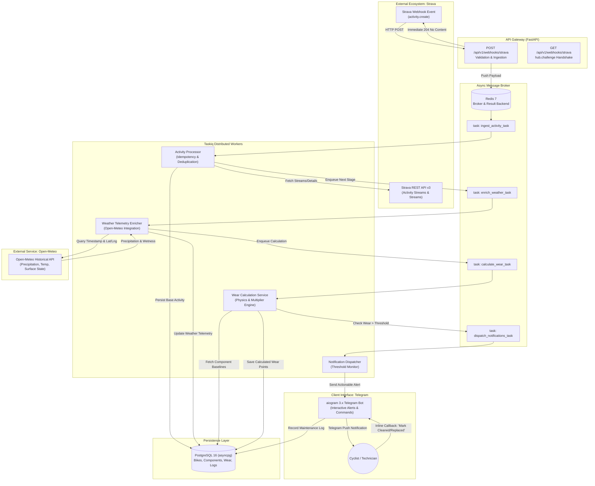

# VeloPulse 🚴⚡

[](https://github.com/Gasewtag/VeloPulse/actions)
[](https://www.python.org/downloads/)
[](https://fastapi.tiangolo.com)
[](https://www.sqlalchemy.org/)
[](https://taskiq-python.github.io/)
[](https://www.postgresql.org/)
[](https://docs.aiogram.dev/)
[](https://www.docker.com/)
[](https://opensource.org/licenses/MIT)

> **Automated Bicycle Component Wear Tracker, Maintenance Scheduler, and Cycling Assistant.**  
> Real-time Strava activity ingestion enriched with meteorological road-surface conditions, high-precision wear calculations, and proactive Telegram maintenance alerts.

---

## 📌 Executive Summary & Problem Statement

Modern cycling tracking platforms (Strava, Garmin Connect, Wahoo) accurately record total bicycle mileage. However, **component degradation is fundamentally non-linear with respect to raw distance**. 

A 60 km winter gravel ride under torrential rain and road grit inflicts up to **3.5× to 5×** more drivetrain and brake pad wear than 60 km on dry, clean summer asphalt or an indoor smart trainer. Cyclists today face two suboptimal outcomes:
1. **Premature Replacement:** Discarding functional chains, cassettes, or tires based on rigid, conservative distance milestones (e.g., replacing a chain strictly every 2,000 km), creating unnecessary expense and material waste.
2. **Catastrophic Failure / Excessive Wear Cascades:** Missing service intervals due to harsh riding conditions. A worn chain that elongates past 0.75% wear rapidly erodes expensive cassette cogs and chainrings, turning a $30 maintenance job into a $350 drivetrain overhaul or causing mid-ride chain snaps.

**VeloPulse** solves this problem by providing an automated, physics- and weather-informed component telemetry platform:
- **Zero-Friction Ingestion:** Passively captures rides via Strava webhooks within milliseconds of activity sync.
- **Micro-Climate Telemetry Enrichment:** Correlates ride timestamps and coordinates with historical meteorological data (precipitation, temperature, surface wetness from Open-Meteo).
- **Multi-Factor Wear Engine:** Computes real wear points based on torque (grade/elevation), environmental abrasiveness (grit/rain), and component material baselines.
- **Actionable Maintenance Interface:** Delivers timely, interactive alerts and quick-action service logging through an asynchronous Telegram bot.

---

## 🏗️ Architecture & Ingestion Flow

VeloPulse implements an event-driven, decoupled micro-monolith designed for resilience, idempotency, and sub-50ms API gateway response times.



---

## 🧩 Domain Entity Model

```
                    ┌────────────────────────┐
                    │         User           │
                    │────────────────────────│
                    │ id: UUID (PK)          │
                    │ strava_athlete_id: int │
                    │ telegram_chat_id: int  │
                    └───────────┬────────────┘
                                │ 1:N
                                ▼
                    ┌────────────────────────┐
                    │         Bike           │
                    │────────────────────────│
                    │ id: UUID (PK)          │
                    │ user_id: UUID (FK)     │
                    │ strava_gear_id: string │
                    │ name: string           │
                    │ bike_type: BikeType    │
                    │ total_distance_m: int  │
                    │ is_active: bool        │
                    └───────────┬────────────┘
                                │ 1:N
        ┌───────────────────────┴───────────────────────┐
        ▼                                               ▼
┌────────────────────────┐                    ┌────────────────────────┐
│       Component        │                    │        Activity        │
│────────────────────────│                    │────────────────────────│
│ id: UUID (PK)          │                    │ id: UUID (PK)          │
│ bike_id: UUID (FK)     │                    │ bike_id: UUID (FK)     │
│ type: ComponentType    │                    │ strava_activity_id: int│
│ brand_model: string    │                    │ distance_m: float      │
│ max_wear_points: float │                    │ total_elevation_m: float│
│ current_wear: float    │                    │ start_time: timestamptz│
│ status: ComponentStatus│                    │ weather_conditions: JSON│
└───────────┬────────────┘                    └───────────┬────────────┘
            │ 1:N                                         │ 1:N
            │                                             │
            │           ┌────────────────────────┐        │
            └──────────►│ ActivityComponentWear  │◄───────┘
                        │────────────────────────│
                        │ id: UUID (PK)          │
                        │ activity_id: UUID (FK) │
                        │ component_id: UUID (FK)│
                        │ wear_delta: float      │
                        │ elevation_factor: float│
                        │ weather_factor: float  │
                        └────────────────────────┘
```

### Domain Core Entities

1. **Bikes**: Mirrors bicycle hardware linked to user profiles and Strava `gear_id` definitions. Tracks aggregate frame distance, bike category (Road, Gravel, MTB, E-Bike), and operational state.
2. **Components**: Represents sub-assemblies subject to mechanical wear:
   - Drivetrain: Chains, Cassettes, Chainrings, Jockey Wheels.
   - Braking: Brake Pads (Front/Rear), Rotors/Rims.
   - Contact & Rolling: Tires (Front/Rear), Sealant, Bearings (Bottom Bracket, Wheel, Headset).
   - Suspension: Fork 50h/200h service intervals, Rear Shock seals.
3. **Wear Calculations (`ActivityComponentWear`)**: Immutable calculation records attributing quantified mechanical wear points to each component for every individual ride.
4. **Maintenance Logs**: Historical record of technician interventions (clean, lubricant applied, replacement, tension adjustment) with associated odometer readings, expenditure, and component lifespan resets.

---

## 🛠️ Technology Stack Breakdown

| Layer | Technology | Version | Rationale & Architectural Choice |
|---|---|---|---|
| **Runtime** | Python | `3.12+` | Performance gains (PEP 709 inlined comprehensions), modern type hinting (`type` statement PEP 695). |
| **API Framework** | FastAPI | `0.111+` | Asynchronous high-throughput ASGI framework with native Pydantic v2 validation and automated OpenAPI 3.1 documentation. |
| **ORM / Data Layer** | SQLAlchemy | `2.0+ (Async)` | Modern async/await ORM syntax, strict query typing, and high-performance connection pooling via `asyncpg`. |
| **Database Migrations** | Alembic | `1.13+` | Version-controlled, declarative, autogenerating database schema evolution. |
| **Database** | PostgreSQL | `16` | Reliable ACID persistence, advanced JSONB indexing for weather payloads, and strong relational constraints. |
| **Distributed Task Queue** | Taskiq | `0.11+` | Async-native Python distributed task queue designed for `asyncio` without Celery's legacy sync overhead. |
| **In-Memory Store / Broker** | Redis | `7-alpine` | High-speed task queue broker, activity deduplication caching, and distributed locking. |
| **User Bot & Messaging** | aiogram | `3.x` | Modern, asynchronous Telegram Bot API framework with Finite State Machine (FSM) support and inline keyboards. |
| **External Weather API** | Open-Meteo | REST API | Zero-auth, non-commercial-friendly historical weather API providing sub-hourly precipitation, surface, and temperature metrics. |
| **Containerization** | Docker & Docker Compose | Compose v2 | Multi-stage, distroless-inspired container builds for reproducible development and production deployments. |
| **Quality & CI/CD** | Ruff / Mypy / Pytest | Latest | Instantaneous linting/formatting via Ruff, strict static type checking via Mypy, and async test suites via `pytest-asyncio`. |

---

## 🚀 Local Setup & Quickstart Guide

### Prerequisites
- [Docker](https://docs.docker.com/get-docker/) (24.0+) & [Docker Compose](https://docs.docker.com/compose/) (v2.20+)
- [Python 3.12+](https://www.python.org/downloads/)
- [uv](https://github.com/astral-sh/uv) or `poetry` (Recommended package manager)
- A [Strava Developer Account](https://www.strava.com/settings/api) for webhook and OAuth credentials
- A [Telegram Bot Token](https://t.me/BotFather) from BotFather

### 1. Clone & Environment Configuration

```bash
git clone https://github.com/Gasewtag/VeloPulse.git
cd VeloPulse
git checkout docs/initial-project-specification

# Create local environment configuration
cp .env.example .env
```

Edit `.env` with your credentials:
```env
# Application Settings
ENVIRONMENT=development
DEBUG=true
SECRET_KEY=generate-a-secure-random-secret-key-32-chars

# PostgreSQL Database
POSTGRES_SERVER=localhost
POSTGRES_PORT=5432
POSTGRES_USER=velopulse_user
POSTGRES_PASSWORD=velopulse_password
POSTGRES_DB=velopulse_db

# Redis Broker
REDIS_URL=redis://localhost:6379/0

# Strava API Credentials
STRAVA_CLIENT_ID=your_client_id
STRAVA_CLIENT_SECRET=your_client_secret
STRAVA_VERIFY_TOKEN=your_custom_webhook_secret_token
STRAVA_WEBHOOK_CALLBACK_URL=https://your-public-url.ngrok-free.app/api/v1/webhooks/strava

# Telegram Bot
TELEGRAM_BOT_TOKEN=your_bot_token_from_botfather
```

### 2. Running via Docker Compose (Recommended)

Boot the entire ecosystem (FastAPI, Redis, PostgreSQL, Taskiq Worker, and Telegram Bot) with a single command:

```bash
docker compose up --build -d
```

Check service health:
```bash
docker compose ps
docker compose logs -f api
```

The FastAPI service and interactive OpenAPI docs will be available at:
- **Interactive Swagger UI:** [http://localhost:8000/docs](http://localhost:8000/docs)
- **ReDoc:** [http://localhost:8000/redoc](http://localhost:8000/redoc)
- **Health Endpoint:** [http://localhost:8000/health](http://localhost:8000/health)

### 3. Local Native Development (Without Full Docker Stack)

If running the application locally for active debugging:

```bash
# 1. Install dependencies using uv
uv venv
source .venv/bin/activate  # On Windows: .venv\Scripts\activate
uv pip install -e ".[dev]"

# 2. Start PostgreSQL and Redis via Docker
docker compose up -d postgres redis

# 3. Apply Alembic migrations
alembic upgrade head

# 4. Start the FastAPI API server
uvicorn velopulse.main:app --host 0.0.0.0 --port 8000 --reload

# 5. In a separate terminal, launch the Taskiq background worker
taskiq worker velopulse.tasks.broker:broker

# 6. In another terminal, launch the Telegram Bot runner
python -m velopulse.bot.main
```

### 4. Setting up Strava Webhook Tunnel (Local Development)

Strava requires a public HTTPS URL with a valid SSL certificate for webhook callbacks:

```bash
# Expose port 8000 via ngrok
ngrok http 8000
```
Update `STRAVA_WEBHOOK_CALLBACK_URL` in `.env` with your ngrok forwarding address, then trigger subscription validation via the VeloPulse management CLI:

```bash
python -m velopulse.cli.strava register-webhook
```

---

## 🧪 Testing & Code Quality

```bash
# Run Ruff lint check and formatting inspection
ruff check .
ruff format --check .

# Run Mypy in strict mode
mypy src/

# Run complete test suite with coverage report
pytest --cov=velopulse --cov-report=term-missing tests/
```

---

## 📄 License

This project is licensed under the terms of the [MIT License](LICENSE).
